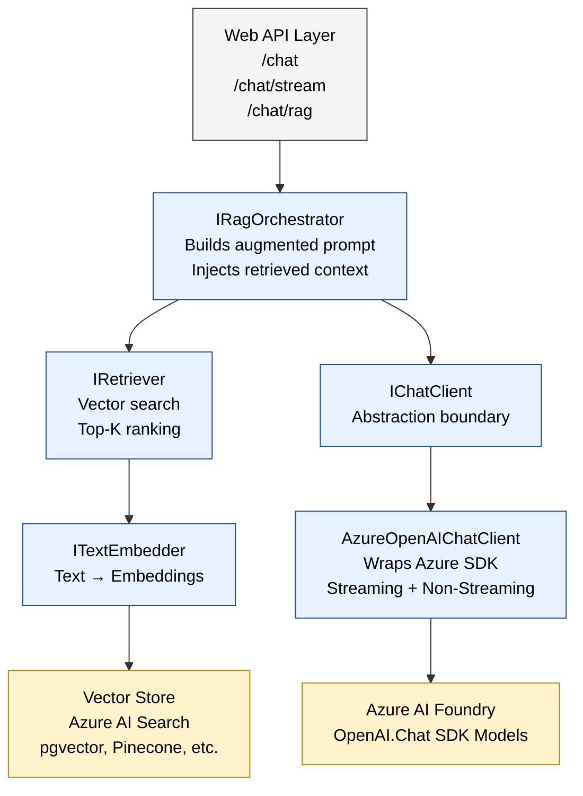

# Flowchart

                         ┌──────────────────────────────┐
                         │         Web API Layer         │
                         │  - /chat                      │
                         │  - /chat/stream               │
                         │  - /chat/rag                  │
                         └───────────────┬───────────────┘
                                         │
                                         ▼
                         ┌──────────────────────────────┐
                         │      IRagOrchestrator         │
                         │  - Builds augmented prompt     │
                         │  - Injects retrieved context   │
                         │  - Applies templates           │
                         └───────────────┬───────────────┘
                                         │
                                         ▼
                         ┌──────────────────────────────┐
                         │          IRetriever           │
                         │  - Vector search              │
                         │  - Top‑K ranking              │
                         │  - Returns RagDocument[]      │
                         └───────────────┬───────────────┘
                                         │
                                         ▼
                         ┌──────────────────────────────┐
                         │        ITextEmbedder          │
                         │  - Converts text → embeddings │
                         │  - Uses embedding model       │
                         └───────────────┬───────────────┘
                                         │
                                         ▼
                         ┌──────────────────────────────┐
                         │        Vector Store           │
                         │  (Azure AI Search, pgvector,  │
                         │   Pinecone, Redis, etc.)      │
                         └───────────────┬───────────────┘
                                         │
                                         ▼
                         ┌──────────────────────────────┐
                         │         IChatClient           │
                         │  - Abstraction boundary       │
                         │  - Portable across providers  │
                         └───────────────┬───────────────┘
                                         │
                                         ▼
                         ┌──────────────────────────────┐
                         │   AzureOpenAIChatClient       │
                         │  - Wraps Azure SDK            │
                         │  - Streaming + non‑streaming  │
                         └───────────────┬───────────────┘
                                         │
                                         ▼
                         ┌──────────────────────────────┐
                         │      Azure AI Foundry         │
                         │   (OpenAI.Chat SDK models)    │
                         └───────────────────────────────┘

# Architecture Diagram

